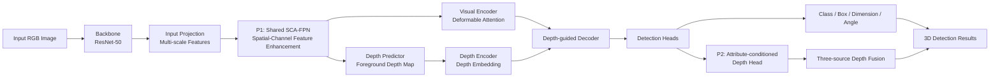
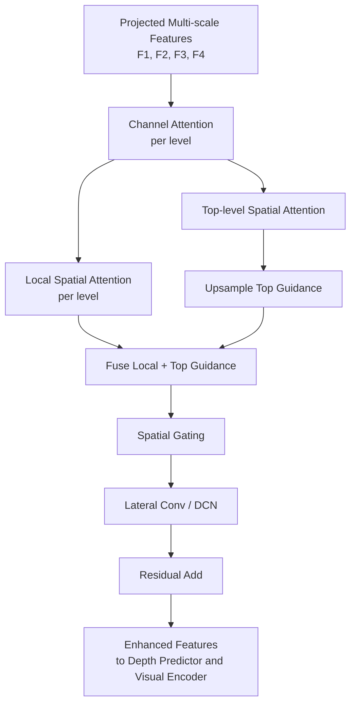
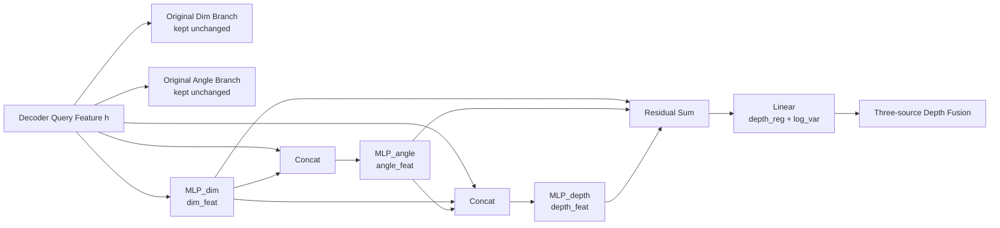

# 基于跨尺度特征增强与属性条件深度预测的单目 3D 目标检测

> 说明：本文为论文初稿。当前已经写入方法、图示、实验设计和已有 P2 实验结果；P1、P1+P2 的最终主实验结果、复杂度数据和可视化图片仍需后续补充。

## 摘要

单目 3D 目标检测旨在仅利用单张 RGB 图像预测目标在三维空间中的位置、尺寸和朝向，是自动驾驶感知系统中的关键任务。由于单目图像缺少显式深度信息，现有方法在远距离小目标、遮挡目标以及深度估计不稳定场景下仍存在检测精度不足的问题。MonoDETR 通过深度引导 Transformer 引入前景深度图和深度交叉注意力，实现了端到端的单目 3D 检测，但其多尺度特征在进入深度预测器和视觉编码器前缺少充分的跨尺度语义引导，同时 decoder 后的尺寸、朝向和深度预测头主要并行工作，未显式建模 3D 属性之间的几何耦合关系。针对上述问题，本文提出一种基于跨尺度特征增强与属性条件深度预测的单目 3D 目标检测方法。首先，设计共享空间-通道特征增强模块，在通道统一后的多尺度特征上引入通道注意力、空间注意力和高层语义引导，增强远距离和遮挡目标的特征表达，并同时提升前景深度预测分支和视觉编码分支的输入质量。其次，提出属性条件引导的深度预测头，通过链式构造尺寸相关特征和朝向相关特征，引导 query-level 深度回归，在保持原始尺寸和朝向预测分支稳定性的同时提高实例级深度估计能力。本文在 KITTI 数据集上开展实验，结果表明所提方法相较于基线模型在单目 3D 检测任务上取得了更优性能，尤其对小目标和困难样本具有更稳定的检测效果。

**关键词**：单目 3D 目标检测；MonoDETR；多尺度特征融合；空间通道注意力；深度估计；属性条件预测

## 1 引言

3D 目标检测是自动驾驶、智能交通和机器人环境感知中的重要任务。与基于激光雷达或多目相机的方法相比，单目 3D 目标检测仅依赖普通 RGB 相机，具有成本低、部署灵活和数据采集方便等优势。然而，单目图像在成像过程中将三维空间投影到二维平面，真实深度信息严重丢失，使得仅从单张图像恢复目标三维位置成为一个典型的不适定问题。

现有单目 3D 检测方法大多围绕深度估计和几何约束展开。一类方法基于中心点检测框架，先定位目标投影中心，再利用中心附近局部特征回归深度、尺寸和朝向。这类方法结构简洁，但容易受局部特征质量限制，尤其在远距离小目标、遮挡目标和复杂背景中，中心区域提供的有效几何线索不足。另一类方法引入深度估计、伪激光雷达、关键点约束或不确定性建模，以缓解单目深度缺失问题，但部分方法依赖额外深度网络、激光雷达监督或复杂后处理，影响端到端训练和实际部署。

近年来，DETR 类方法通过 object query 和二分图匹配实现了端到端目标检测。MonoDETR 将 DETR 框架引入单目 3D 检测，通过前景深度图、深度编码器和深度交叉注意力，使 query 能够在全局范围内聚合深度线索，避免传统中心引导方法只依赖局部特征的问题。然而，本文通过分析 MonoDETR 的模型结构发现，其仍存在两个值得改进的环节。

第一，MonoDETR 的 backbone 输出多尺度特征后，主要通过 `1x1` 卷积进行通道统一，然后直接送入前景深度预测器和 depth-aware transformer。该过程缺少显式的跨尺度语义引导。对于远距离行人和骑行者等小目标，浅层特征具有较高分辨率但语义较弱，深层特征语义较强但空间细节不足，简单通道投影难以充分融合二者优势。

第二，MonoDETR 的检测头中，尺寸、朝向和深度预测主要以并行方式从 decoder query 特征中产生。单目 3D 检测中的深度并非孤立属性，目标真实尺寸会影响其图像投影尺度，朝向会影响可见形态和 2D 边界，三者存在显著几何耦合关系。若深度头仅从 query 特征独立预测深度，容易忽略属性间的条件关系，导致实例级深度估计不稳定。

针对上述问题，本文从前端特征表达和后端深度预测两个层面对 MonoDETR 进行改进。首先，在 backbone 与深度引导 Transformer 之间加入共享空间-通道特征增强模块，对通道统一后的多尺度特征进行增强，并将增强后的特征同时送入前景深度预测器和视觉编码器。其次，在检测头阶段提出属性条件引导的深度预测头，通过尺寸相关特征和朝向相关特征辅助 depth regression，从而增强 query-level 深度估计。

本文主要贡献如下：

1. 提出一种共享空间-通道特征增强模块，在 MonoDETR 的视觉-深度双分支输入前对多尺度特征进行增强，使前景深度预测和视觉编码同时受益。
2. 提出一种属性条件引导的深度预测头，通过链式属性特征建模引导实例级深度回归，并保留原始尺寸和朝向预测路径以维持训练稳定性。
3. 在 KITTI 数据集上开展对比实验、消融实验和误差分析，验证所提方法在单目 3D 检测任务中的有效性。

## 2 相关工作

### 2.1 单目 3D 目标检测

单目 3D 目标检测需要从单张图像中预测目标类别、二维框、三维位置、三维尺寸和朝向。由于缺少直接深度观测，早期方法通常借助几何先验、CAD 模型、关键点或 2D-3D 投影约束推断目标三维框。随着深度学习发展，CenterNet、FCOS3D、MonoDLE、MonoFlex 等方法采用中心点或 anchor-free 框架，直接从图像特征中回归 3D 属性。这类方法具有较高效率，但对局部中心特征依赖较强，在小目标和遮挡目标中容易出现深度误差。

### 2.2 基于 Transformer 的单目 3D 检测

DETR 通过 object query、Transformer 编码解码结构和 Hungarian matching 实现端到端检测。MonoDETR 将该思想扩展到单目 3D 检测中，引入前景深度图和深度交叉注意力，使 query 能够从全局深度区域自适应聚合几何信息。与传统中心引导方法相比，MonoDETR 不依赖 anchor 和 NMS，具有更好的全局建模能力。本文以 MonoDETR 为基线，在保持其端到端框架的基础上改进输入特征表达和 query-level 深度预测。

### 2.3 多尺度特征融合与深度建模

多尺度特征融合是提升小目标检测能力的重要手段。FPN、PANet、BiFPN 等方法通过自顶向下或双向路径融合不同尺度特征，使高层语义和低层细节互补。在单目 3D 检测中，多尺度特征不仅影响目标分类和定位，也影响前景深度图预测。另一方面，深度估计是单目 3D 检测的核心难点，已有方法通过深度分类、深度不确定性、动态深度分桶或几何约束改善深度预测。不同于仅改进深度图分支的方法，本文进一步关注 decoder query 后的实例级深度回归头，使最终 3D 框深度预测显式利用尺寸和朝向条件。

## 3 方法

### 3.1 基线模型回顾

本文以 MonoDETR 为基线。给定输入图像，模型首先通过 ResNet-50 提取多尺度视觉特征，并通过通道投影得到统一维度的特征集合。随后，Depth Predictor 利用多尺度特征生成前景深度图和深度位置编码；Depth-aware Transformer 通过视觉编码器、深度编码器和深度引导解码器生成 object query 特征；最后检测头分别预测类别、二维框、投影 3D 中心、深度、3D 尺寸和朝向。

MonoDETR 最终深度由三部分融合得到：

```text
D = (D_reg + D_geo + D_map) / 3
```

其中，`D_reg` 表示 query-level 深度回归结果，`D_geo` 表示由物体高度、2D 框高度和相机焦距计算得到的几何深度，`D_map` 表示从前景深度图在预测 3D 中心位置采样得到的深度。本文的 P2 模块主要作用于 `D_reg` 的生成过程。

### 3.2 整体框架

本文方法在 MonoDETR 基础上加入两个改进模块：共享空间-通道特征增强模块和属性条件引导深度预测头。整体结构如图 1 所示。



**图 1 本文方法整体框架。** P1 位于 backbone 与深度引导 Transformer 之间，同时影响前景深度预测分支和视觉编码分支；P2 位于检测头阶段，仅增强 query-level 深度回归。

### 3.3 共享空间-通道特征增强模块

原始 MonoDETR 对 backbone 输出的多尺度特征主要进行通道对齐，缺少进一步跨尺度特征增强。为提升远距离小目标和遮挡目标的特征表达能力，本文设计共享空间-通道特征增强模块。该模块接收通道统一后的多尺度特征：

```text
F = {F_1, F_2, F_3, F_4}
```

其中各层特征对应不同下采样倍率。模块包含通道注意力、局部空间注意力、高层语义引导和残差连接。

首先，对每一层特征施加通道注意力：

```text
F_i^c = F_i · CA(F_i)
```

通道注意力通过全局平均池化和最大池化建模通道重要性，用于抑制冗余通道并突出与目标相关的语义响应。

其次，对每一层特征计算空间注意力：

```text
S_i = SA(F_i^c)
```

考虑到高层特征具有更强语义判别能力，本文将最高层空间注意力上采样到低层尺度，与低层局部空间注意力融合：

```text
S_i^f = 0.5 · (S_i + Up(S_top))
```

最后，通过 lateral convolution 和残差连接得到增强特征：

```text
\hat{F_i} = Lateral(F_i^c · S_i^f) + F_i
```

本文将增强后的多尺度特征同时送入 Depth Predictor 和 Depth-aware Transformer。这样做的原因是，前景深度预测需要更清晰的目标区域与深度结构，视觉编码器也需要更高质量的多尺度外观特征。相比只增强 depth branch，共享增强方式能保持视觉与深度分支输入的一致性。



**图 2 共享空间-通道特征增强模块结构。** 高层语义注意力用于引导低层高分辨率特征，使小目标特征同时具备细节和语义信息。

### 3.4 属性条件引导的深度预测头

原始 MonoDETR 中，尺寸、朝向和深度预测头主要并行工作：

```text
h -> dim head
h -> angle head
h -> depth head
```

其中 `h` 为 decoder 输出的 query feature。该结构虽然简单，但没有显式建模深度与尺寸、朝向之间的条件关系。事实上，在单目 3D 检测中，目标深度与真实尺寸、图像投影尺度和朝向存在几何耦合。例如，在相同 2D 框高度下，不同真实高度的目标对应不同深度；不同朝向会改变目标可见形态和投影边界，进而影响深度判断。

为此，本文提出属性条件引导的深度预测头。设第 `i` 个 query 的特征为 `h_i`，模块首先提取尺寸相关条件特征：

```text
f_i^s = F_s(h_i)
```

然后结合 query 特征和尺寸条件特征生成朝向相关条件特征：

```text
f_i^o = F_o([h_i, f_i^s])
```

最后融合 query 特征、尺寸条件和朝向条件生成深度回归特征：

```text
f_i^d = F_d([h_i, f_i^s, f_i^o])
```

为了加强条件信息传递，本文采用残差式融合：

```text
\tilde{f_i^d} = f_i^d + f_i^s + f_i^o
```

并输出深度回归值和不确定性项：

```text
r_i = W_d \tilde{f_i^d} + b_d
```

其中 `r_i` 的维度保持为 2，与原始 MonoDETR 的 depth head 输出一致。需要强调的是，本文并不直接替换最终尺寸和朝向预测分支，而仅将尺寸相关特征和朝向相关特征作为 depth head 内部条件，用于增强深度回归。这样能够避免破坏原始 dim/angle 分支的稳定性。



**图 3 属性条件引导的深度预测头。** 模块仅替换 query-level depth regression head，保留原始尺寸和朝向输出分支。

### 3.5 损失函数

本文保持 MonoDETR 的整体损失设计，包括分类损失、2D 框损失、GIoU 损失、3D 中心投影损失、尺寸损失、朝向损失、深度损失和前景深度图损失。整体损失可表示为：

```text
L = λ_cls L_cls + λ_box L_box + λ_giou L_giou
  + λ_center L_center + λ_dim L_dim
  + λ_angle L_angle + λ_depth L_depth
  + λ_dmap L_dmap
```

其中深度损失采用带不确定性的拉普拉斯形式：

```text
L_depth = sqrt(2) · exp(-s) · |D_pred - D_gt| + s
```

`s` 表示预测的 log variance。本文 P2 模块不改变损失接口，只改变 `D_reg` 的生成方式，因此能够与原始 MonoDETR 的训练流程兼容。

## 4 实验与结果分析

### 4.1 数据集与评价指标

本文在 KITTI 3D Object Detection 数据集上验证所提方法。KITTI 数据集包含 7481 张训练图像和 7518 张测试图像。按照常用划分方式，训练集可进一步划分为 3712 张训练图像和 3769 张验证图像。检测类别包括 Car、Pedestrian 和 Cyclist。

本文采用 KITTI 官方评价指标，包括 3D 平均精度 `AP_3D` 和鸟瞰图平均精度 `AP_BEV`，并按照 Easy、Moderate 和 Hard 三种难度进行评估。若无特殊说明，主要报告 `AP_R40` 指标。

### 4.2 实验设置

模型采用 ResNet-50 作为 backbone，输入图像分辨率为 `1280 × 384`。Transformer 隐藏维度为 256，encoder 和 decoder 层数均为 3，object query 数量为 50。前景深度图采用 80 个深度 bin，深度范围为 `[0.001m, 60m]`。模型使用 AdamW 优化器训练 195 个 epoch，初始学习率为 `2e-4`，权重衰减为 `1e-4`。

> 待补充：实际训练 GPU、batch size、学习率衰减 epoch、随机种子数量、是否使用同一 checkpoint selection 规则。

### 4.3 与现有方法对比

表 1 给出本文方法与已有单目 3D 检测方法在 KITTI 数据集上的对比。当前表格需要在完成最终实验后补充正式结果。

**表 1 KITTI 测试集 Car 类别检测结果对比（待补充）**

| 方法 | 额外数据 | AP3D Easy | AP3D Mod. | AP3D Hard | APBEV Easy | APBEV Mod. | APBEV Hard |
|---|---|---:|---:|---:|---:|---:|---:|
| MonoDLE | 无 | 待补充 | 待补充 | 待补充 | 待补充 | 待补充 | 待补充 |
| GUPNet | 无 | 待补充 | 待补充 | 待补充 | 待补充 | 待补充 | 待补充 |
| MonoFlex | 无 | 待补充 | 待补充 | 待补充 | 待补充 | 待补充 | 待补充 |
| MonoDETR | 无 | 待补充 | 待补充 | 待补充 | 待补充 | 待补充 | 待补充 |
| 本文方法 | 无 | 待补充 | 待补充 | 待补充 | 待补充 | 待补充 | 待补充 |

### 4.4 主消融实验

为验证两个模块的有效性，本文设计如下消融实验：Baseline、Baseline + P1、Baseline + P2、Baseline + P1 + P2。

**表 2 P1 与 P2 主消融实验（待补充 P1/P1+P2 结果）**

| 方法 | P1 | P2 | Car Mod. | Pedestrian Mod. | Cyclist Mod. | 三类均值 |
|---|---|---|---:|---:|---:|---:|
| Baseline | × | × | 待补充 | 待补充 | 待补充 | 待补充 |
| Baseline + P1 | √ | × | 待补充 | 待补充 | 待补充 | 待补充 |
| Baseline + P2 | × | √ | 19.8446 | 6.6312 | 4.6792 | 10.3850 |
| Baseline + P1 + P2 | √ | √ | 待补充 | 待补充 | 待补充 | 待补充 |

### 4.5 P2 模块消融实验

本文进一步比较原始 depth head、Full CoP replacement 和 Depth-only 属性条件深度头。已有三次重复实验结果如表 3 所示。

**表 3 属性条件深度预测头消融实验（KITTI val，AP3D R40，mean ± std）**

| 方法 | Car Mod. | Car Hard | Ped. Mod. | Ped. Hard | Cyc. Mod. | Cyc. Hard |
|---|---:|---:|---:|---:|---:|---:|
| Baseline | 19.3613±0.6280 | 16.3624±0.8570 | 5.4446±0.3652 | 4.3327±0.2982 | 4.4688±0.6479 | 4.1673±0.5800 |
| Full CoP replacement | 18.9896±0.9216 | 15.9353±0.7208 | 6.2343±0.6636 | 4.8963±0.5455 | 4.0119±0.9861 | 3.6968±0.7612 |
| Depth-only 属性条件深度头 | 19.8446±0.8441 | 16.3172±0.3251 | 6.6312±0.5641 | 5.0365±0.2055 | 4.6792±0.7122 | 4.1179±0.2878 |

由表 3 可知，Full CoP replacement 虽然提升了 Pedestrian 类别性能，但导致 Car 和 Cyclist 性能下降，说明直接替换全部属性预测头会破坏 MonoDETR 原有属性分支的稳定性。相比之下，Depth-only 属性条件深度头保留原始尺寸和朝向预测路径，仅增强深度预测，在 Pedestrian Moderate 和 Hard 上分别提升 1.1866 和 0.7038，同时 Car Moderate 提升 0.4833，Cyclist Moderate 提升 0.2105，整体表现更稳定。因此，本文最终采用 Depth-only 设计。

### 4.6 P1 模块消融实验

为分析共享空间-通道特征增强模块中各组成部分的作用，建议补充表 4 所示实验。

**表 4 P1 模块结构消融实验（待补充）**

| 方法 | CA | SA | High Guidance | DCN Lateral | Car Mod. | Ped. Mod. | Cyc. Mod. |
|---|---|---|---|---|---:|---:|---:|
| Baseline | × | × | × | × | 待补充 | 待补充 | 待补充 |
| CA only | √ | × | × | × | 待补充 | 待补充 | 待补充 |
| CA + SA | √ | √ | × | × | 待补充 | 待补充 | 待补充 |
| CA + SA + High Guidance | √ | √ | √ | × | 待补充 | 待补充 | 待补充 |
| Full P1 | √ | √ | √ | √ | 待补充 | 待补充 | 待补充 |

### 4.7 深度误差分析

为进一步说明本文方法对深度估计的影响，建议统计不同距离范围内的深度平均绝对误差。距离可划分为 `0-20m`、`20-40m` 和 `40m+`。

**表 5 不同距离范围深度 MAE 对比（待补充）**

| 方法 | 0-20m | 20-40m | 40m+ | Overall |
|---|---:|---:|---:|---:|
| MonoDETR | 待补充 | 待补充 | 待补充 | 待补充 |
| 本文方法 | 待补充 | 待补充 | 待补充 | 待补充 |

### 4.8 复杂度分析

为了证明本文方法不是简单依赖大量参数提升性能，需要补充模型参数量、计算量和推理速度。

**表 6 模型复杂度对比（待补充）**

| 方法 | Params/M | FLOPs/G | FPS | Car AP3D Mod. |
|---|---:|---:|---:|---:|
| MonoDETR | 待补充 | 待补充 | 待补充 | 待补充 |
| MonoDETR + P1 | 待补充 | 待补充 | 待补充 | 待补充 |
| MonoDETR + P2 | 待补充 | 待补充 | 待补充 | 待补充 |
| 本文方法 | 待补充 | 待补充 | 待补充 | 待补充 |

### 4.9 可视化分析

建议补充两类可视化图片：

1. 3D 检测框可视化：对比 MonoDETR 与本文方法在远距离车辆、行人、骑行者和遮挡场景下的 3D 框预测效果。
2. 注意力或特征响应可视化：展示 P1 后小目标区域响应增强，或展示 depth map 在前景区域的改善。

**图 4 检测结果可视化（待插入）**

```text
左：输入图像
中：MonoDETR 检测结果
右：本文方法检测结果
```

**图 5 深度图或特征响应可视化（待插入）**

```text
左：Baseline depth map / feature response
右：本文方法 depth map / feature response
```

## 5 结论

本文针对 MonoDETR 在单目 3D 检测中存在的多尺度特征表达不足和实例级深度预测缺少属性条件约束的问题，提出一种基于跨尺度特征增强与属性条件深度预测的改进方法。首先，本文设计共享空间-通道特征增强模块，对通道统一后的多尺度特征进行空间和通道重标定，并利用高层语义注意力引导低层高分辨率特征，从而同时提升前景深度预测和视觉编码输入质量。其次，本文提出属性条件引导的深度预测头，在 query-level 深度回归中引入尺寸相关特征和朝向相关特征，使深度预测能够利用 3D 属性间的几何耦合关系。实验结果表明，所提方法能够提升单目 3D 检测性能，尤其对 Pedestrian 等小目标类别具有更稳定的改善效果。未来工作将进一步研究更精细的深度融合策略和小目标 query 分配机制，以提升复杂场景下的单目 3D 检测鲁棒性。

## 参考文献

> 说明：以下为初稿参考文献列表，后续需要按目标期刊/会议格式统一排版，并补全页码、会议/期刊信息。

[1] Carion N, Massa F, Synnaeve G, et al. End-to-End Object Detection with Transformers. ECCV, 2020.

[2] Zhu X, Su W, Lu L, et al. Deformable DETR: Deformable Transformers for End-to-End Object Detection. ICLR, 2021.

[3] Zhang R, Qiu H, Wang T, et al. MonoDETR: Depth-guided Transformer for Monocular 3D Object Detection. ICCV, 2023.

[4] Ma X, Zhang Y, Xu D, et al. Delving into Localization Errors for Monocular 3D Object Detection. CVPR, 2021.

[5] Zhang Y, Lu J, Zhou J. Objects are Different: Flexible Monocular 3D Object Detection. CVPR, 2021.

[6] Reading C, Harakeh A, Chae J, et al. Categorical Depth Distribution Network for Monocular 3D Object Detection. CVPR, 2021.

[7] Wang T, Zhu X, Pang J, et al. FCOS3D: Fully Convolutional One-Stage Monocular 3D Object Detection. ICCV Workshops, 2021.

[8] Liu Z, Lin Y, Cao Y, et al. Swin Transformer: Hierarchical Vision Transformer using Shifted Windows. ICCV, 2021.

[9] Lin T Y, Dollár P, Girshick R, et al. Feature Pyramid Networks for Object Detection. CVPR, 2017.

[10] Woo S, Park J, Lee J Y, et al. CBAM: Convolutional Block Attention Module. ECCV, 2018.

## 后续需要补充的数据和图片清单

1. Baseline、P1 only、P2 only、P1+P2 的完整 KITTI val 结果，最好 3 个 seed，报告 `mean ± std`。
2. KITTI test set 正式提交结果，至少 Car 类别 AP3D/APBEV Easy、Moderate、Hard。
3. P1 结构消融：CA、SA、High Guidance、DCN lateral 的逐项结果。
4. P2 进一步消融：去掉 `dim_feat`、去掉 `angle_feat`、Full CoP、Depth-only CoP。
5. 复杂度数据：Params、FLOPs、FPS、GPU 型号和 batch size。
6. 深度误差数据：按距离段统计 MAE，建议 `0-20m`、`20-40m`、`40m+`。
7. 可视化图片：至少 4 组场景，包括远距离车辆、行人、骑行者、遮挡或截断目标。
8. 如果目标期刊要求英文摘要，需要补充英文题目、英文摘要和英文关键词。
